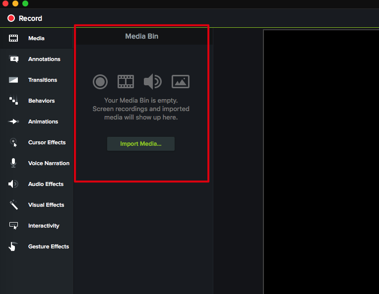
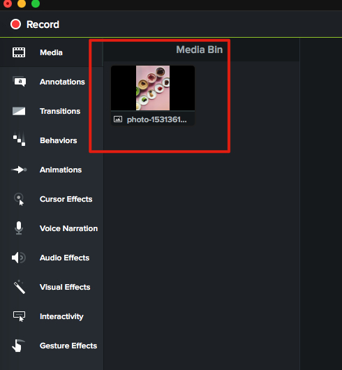
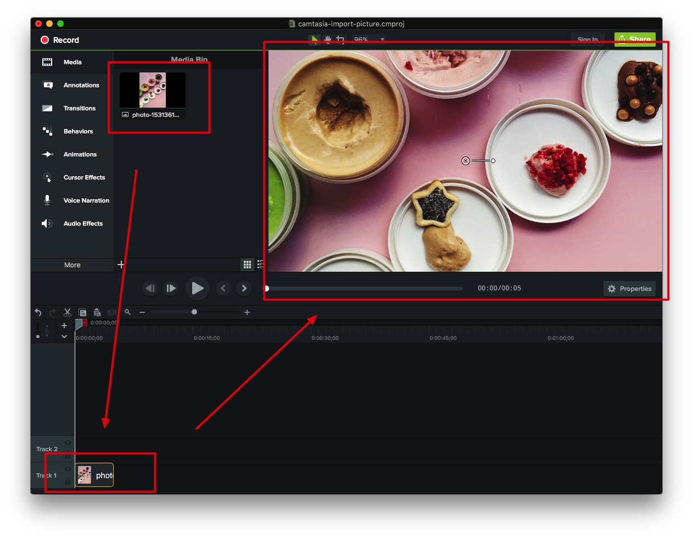

如何在Camtasia3中导入照片
=================

首先打开Camtasia3，可以看到图中叫做`Media Bin`的面板，它就是用来存放我们导入的照片（以及视频等素材）的地方

我们可以从文件夹中把照片拖到Media Bin中，它们会显示出来：

把照片从Media Bin中拖到下面的Timeline，它就会在右边的大面板中显示出来：

项目中的`camtasia-import-picture.cmproj`文件夹是一个完整的camtasia3项目，可以下载后在camtasia中打开看到效果。

Resources
---------

项目中使用的图片来自于: <https://unsplash.com/photos/qEOV3icU_Y4>